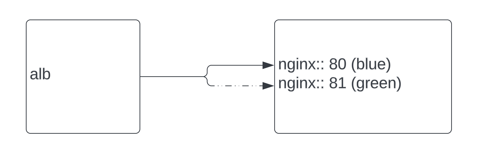
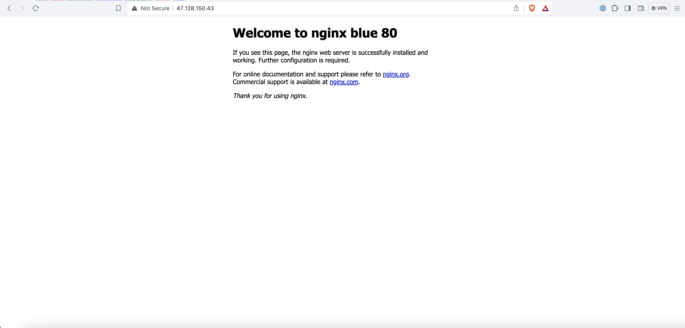
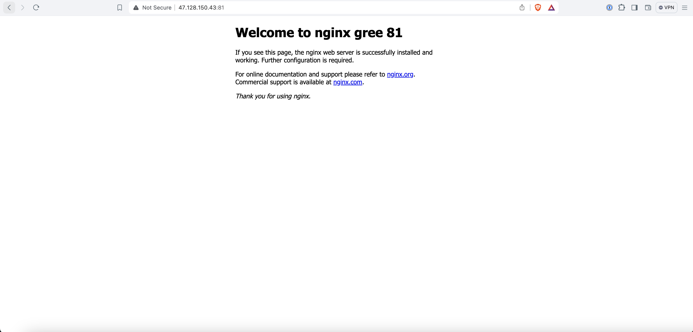

## Overview



We can switch the load balancer to serve traffic to either the blue or green environment. This allows us to have an internal load balancer that correctly chooses the test environment and exposes the desired deployment.

```
ansible --version                                                                                                                      1 ✘ │ 04:59:30 
ansible [core 2.17.0]
  config file = None
  configured module search path = ['/Users/b/.ansible/plugins/modules', '/usr/share/ansible/plugins/modules']
  ansible python module location = /opt/homebrew/Cellar/ansible/10.0.0/libexec/lib/python3.12/site-packages/ansible
  ansible collection location = /Users/b/.ansible/collections:/usr/share/ansible/collections
  executable location = /opt/homebrew/bin/ansible
  python version = 3.12.3 (main, Apr  9 2024, 08:09:14) [Clang 15.0.0 (clang-1500.3.9.4)] (/opt/homebrew/Cellar/ansible/10.0.0/libexec/bin/python)
  jinja version = 3.1.4
  libyaml = True
```

## Known Issues and Areas for Improvement

For testing old method deployment. Due to time constraints, not all potential improvements and features were implemented. Below are the current limitations and areas for enhancement.

1. **SSL/TLS Implementation**
   - **Current State**: Basic implementation or none.
   - **Improvement**: Implement proper SSL/TLS configuration to ensure secure data transmission.

2. **Dynamic `destination_path` Handling**
   - **Current State**: The application does not support changes to `destination_path` dynamically and lacks condition handling.
   - **Improvement**: Add condition handling and support for multiple `destination_path` values to enhance flexibility.

3. **Resource Cleanup Before Deployment**
   - **Current State**: Resources are not cleaned up before placing new ones.
   - **Improvement**: Implement a cleanup routine to ensure that resources are properly managed before new deployment.

4. **Nginx Configuration**
   - **Current State**: Nginx configuration is overridden entirely.
   - **Improvement**: Modify Nginx to read specific server blocks instead of overriding the entire configuration, allowing for more modular and maintainable setups.

5. **Templating System**
   - **Current State**: The current templating system is not very generic and does not support multiple use cases.
   - **Improvement**: Upgrade the templating system to make it more generic and capable of supporting a wider range of scenarios.

6. **Blue/Green Deployment Cleanup**
   - **Current State**: The system does not kill the test environment (blue or green) after testing is completed.
   - **Improvement**: Implement functionality to update the server block file and properly terminate the test environment after use.


# Configuration

```sh
├── inventory
│   └── dev
│       ├── group_vars
│       │   └── all.yml
│       └── hosts.ini
```

## 1. Config host

`inventory/dev/hosts.ini`

```
[api]
api-1 ansible_host=<ip_address> ansible_user=<username> ansible_ssh_private_key_file=<key_using_ssh>
```

## 2. Config Path

`inventory/dev/group_vars/all.yml`

```sh
source_zip_path: ./web-<blue|green>.zip # zip of file(s) not folder
destination_path: /app
```

## 3. Test Connection

```sh
> ansible-playbook -i inventory/dev/hosts.ini check-connection.yml

PLAY [all] *********************************************************************************************

TASK [Test connection] *********************************************************************************
[WARNING]: Platform linux on host api-1 is using the discovered Python interpreter at /usr/bin/python3.9, but future installation of another Python interpreter could change the meaning
of that path. See https://docs.ansible.com/ansible-core/2.17/reference_appendices/interpreter_discovery.html for more information.
ok: [api-1]

PLAY RECAP *********************************************************************************************
api-1                      : ok=1    changed=0    unreachable=0    failed=0    skipped=0    rescued=0    ignored=0
```

## 4. Deploy Blue (on port 80)

note: we can add ssl later

```yml
# `inventory/dev/group_vars/all.yml`
source_zip_path: ./web-blue.zip # zip of file(s) not folder
destination_path: /app
```

Then run

```sh
> ansible-playbook -i inventory/dev/hosts.ini deploy-blue.yml
```



## 5. Deploy Green (on port 81)

note: we can add ssl later

```yml
# `inventory/dev/group_vars/all.yml`
source_zip_path: ./web-green.zip # zip of file(s) not folder
destination_path: /app
```

Then run

```sh
> ansible-playbook -i inventory/dev/hosts.ini deploy-green.yml
```


